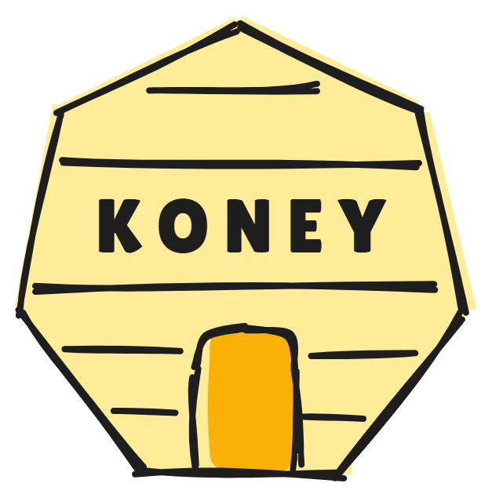

<!-- markdownlint-disable no-inline-html first-line-h1 -->

<p align="center">
  
</p>

# Koney: Automated Cyber Traps for Cloud-Native Apps

[](https://github.com/dynatrace-oss/koney/releases/latest)
[](LICENSE.txt)

**Koney is a Kubernetes operator that enables you to define so-called deception policies for your cluster.**
Koney automates the setup, rotation, and teardown of honeytokens and fake API endpoints, and uses eBPF to detect, log, and forward alerts when your traps have been accessed.

Currently, Koney supports the deployment of [honeytokens](https://en.wikipedia.org/wiki/Honeytoken), i.e., files that appear sensitive and are placed in strategic locations to detect unauthorized access to sensitive data. Soon, we also support other cyber deception techniques, such as deceptive HTTP endpoints and payloads. Contributions are welcome!

- 🪤 Deter Attackers.
- 🔎 Build Threat Intelligence.
- 🚢 Designed for Kubernetes.

## 🚀 Quickstart

Install the operator in your cluster and wait for it to be ready:

```sh
kubectl apply -f https://raw.githubusercontent.com/dynatrace-oss/koney/refs/tags/v0.1.0/dist/install.yaml
kubectl wait --for=condition=ready pod -n koney-system -l control-plane=controller-manager
```

Deploy a sample deception policy:

```sh
kubectl apply -f https://raw.githubusercontent.com/dynatrace-oss/koney/main/config/samples/deceptionpolicy-servicetoken.yaml
```

This policy will add a honeytoken at `/run/secrets/koney/service_token` in all pods that have the label `demo.koney/honeytoken=true` set.
Place that label on a pod or deployment to see the honeytoken in action:

```sh
kubectl label pod <pod-name> demo.koney/honeytoken=true
```

Try accessing the honeytoken:

```sh
kubectl exec -it <pod-name> -- cat /run/secrets/koney/service_token
```

ℹ️ **Note:** To monitor traps and receive alerts, [Tetragon](https://tetragon.io/docs/installation/kubernetes/) must also be installed with the `dnsPolicy=ClusterFirstWithHostNet` configuration. See [Captor Deployment](#captor-deployment) for more information.

Wait a few seconds, and observe the alert that is generated when the honeytoken is accessed:

```sh
kubectl logs -n koney-system -l control-plane=controller-manager -c alerts -f --since 1h
```

## 📃 Usage

|                               🚨 **Important: Koney is an early-stage research project!** 🚨                                |
| :-------------------------------------------------------------------------------------------------------------------------: |
| We recommend using Koney in a test environment. The API and behavior may change without prior notice. Use at your own risk. |

To deploy traps in our cluster, we need to create `DeceptionPolicy` custom resources.

### Deception Policy

A deception policy is a custom resource definition (CRD) that defines the traps that we want to deploy and in which pods we want to deploy them. A deception policy has kind `DeceptionPolicy` and includes a collection of `traps`. Each trap has the following fields:

- Its type (e.g., `filesystemHoneytoken` for honeytokens) and some trap-specific fields.
- A `match` entry that selects to what resources the trap shall be applied.
- A `decoyDeployment` entry that defines how the trap itself shall be deployed.
- A `captorDeployment` entry that defines how monitoring of the trap shall be deployed.

Moreover, the following fields apply to the whole policy and all traps:

- `strictValidation`: a boolean that indicates whether the policy should be strictly validated. The default value is `true`, which means that the traps in the policy are deployed only if all the traps are valid. If `strictValidation` is set to `false`, the policy is still applied, but only the valid traps are deployed. A trap is considered valid if all the required fields are present and their values are valid.
- `mutateExisting`: a boolean that indicates whether the traps should be deployed in objects that already existed before the policy was created. The default value is `true`, which means that the traps are also added to existing objects. Typically, that means that existing resource definitions will be updated to include the traps. Depending on the decoy and captor deployment strategies of each individual trap, this may require restarting the pods. If you want to avoid that existing workloads are restarted, set `mutateExisting` to `false`.

To apply a deception policy, use the following command:

```sh
kubectl apply -f <deceptionpolicy-file>.yaml
```

To delete a deception policy, use the following command:

```sh
kubectl delete -f <deceptionpolicy-file>.yaml
```

ℹ️ **Note:** Deception policies are cluster-wide objects, so no namespace is specified.

#### `filesystemHoneytoken` Trap

The `filesystemHoneytoken` trap deploys a honeytoken in the filesystem of a pod. It has the following fields:

- `filePath`: the path where the honeytoken is deployed. It must be an absolute path and must point to a file. Note that if the `filePath` is a symbolic link, captors deployed with Tetragon will not be able to capture the access to the file (as explained [here](https://isovalent.com/blog/post/file-monitoring-with-ebpf-and-tetragon-part-1/#whats-in-a-pathname)).
- `fileContent`: the content of the honeytoken file. By default, it is an empty string.
- `readOnly`: a boolean that indicates whether the honeytoken file is read-only. The default value is `true`.

🧪 For example, the following `filesystemHoneytoken` trap deploys a read-only honeytoken in the `/run/secrets/koney/service_token` file with the content `someverysecrettoken`:

```yaml
traps:
  - filesystemHoneytoken:
      filePath: /run/secrets/koney/service_token
      fileContent: "someverysecrettoken"
      readOnly: true
```

#### Match

The `match` field is used to select the Kubernetes resources (i.e., pods or deployments, and containers) where we want to deploy the trap. It contains the `any` field, which includes resource filters that will be matched with a logical OR operation.

The `any` field is a list and holds one or more `resources` objects, which contain the following filters (both `namespaces` and `selector` are optional, but at least one of the two must be present):

- `namespaces`: a list of namespaces. It does NOT support wildcards. The trap is only deployed in pods that belong to any of the namespaces in the list.
- `selector`: a label selector. It does NOT support wildcards. The trap is only deployed in pods with labels that match the selector. If you specify multiple labels or expressions, all of them have to match for traps to be deployed. `selector` has two fields:

  - `matchLabels`: a map of key-value pairs.
  - `matchExpressions`: a list of label selector requirements evaluated as a logical AND operation. **(not implemented yet)**

- `containerSelector`: selects the container(s) in the matched pods or deployments where the trap is deployed. It supports the same pattern syntax as [`filepath.Match`](https://pkg.go.dev/path/filepath#Match) (e.g., `*` matches zero or more characters, `?` matches any single characte. The default value is `*`, which means that the trap is deployed in all containers in the matched pods.

🧪 For example, the following `match` field selects all pods in the `koney` namespace, and all pods with the label `demo.koney/honeytoken: "true"`:

```yaml
match:
  any:
    - resources:
        namespaces:
          - koney
        selector:
          matchLabels:
            demo.koney/honeytoken: "true"
        containerSelector: "*"
```

ℹ️ **Note**: Tetragon's tracing policies do not support wildcards in the `containerSelector` field. This is not a problem when the `containerSelector` field is set to a specific container name or set to `*`. However, when the `containerSelector` field is set to a pattern, the tracing policy is created with an empty `containerSelector` field, matching all containers in the pod. See [Captor Deployment](#captor-deployment) for more information about tracing policies. Moreover, tracing policies do not support the `namespaces` field. Therefore, tracing policies match pods in all namespaces.

#### Decoy Deployment

The `decoyDeployment` field defines how a trap is deployed. It has the following fields:

- `strategy`: the strategy used to deploy the trap. It can be `volumeMount`, `containerExec`, or `kyvernoPolicy`. The default value is `volumeMount`. Based on the strategy, Koney matches different types of resources. The strategies are:

  - `volumeMount`: the trap is deployed by mounting a volume in the matched pods. Koney matches deployments.
  - `containerExec`: the trap is deployed by executing a command in the container(s) of the matched pods. Koney matches pods.
  - `kyvernoPolicy`: the trap is deployed by creating a Kyverno policy that mutates manifests such that they also contain traps. Requires that [Kyverno](https://kyverno.io/) is installed in the cluster. **(not implemented yet)**

ℹ️ **Note**: At the moment, Koney does not match ReplicaSet, DaemonSet, StatefulSet, and Jobs.

ℹ️ **Note**: Some values are trap-specific. Refer to the trap-specific documentation above to learn more.

🧪 For example, the following `decoyDeployment` field deploys a honeytoken in all containers in the matched pods using the `containerExec` strategy:

```yaml
decoyDeployment:
  strategy: containerExec
```

#### Captor Deployment

The `captorDeployment` field defines how a captor is deployed. It has the following fields:

- `strategy`: the strategy used to deploy the captor. At the moment, it can only be `tetragon`. The default value is `tetragon`. The strategies are:

  - `tetragon`: the captor is deployed by creating and applying a Tetragon `TracingPolicy` CR in the cluster. Requires that [Tetragon](https://tetragon.io/) is installed in the cluster with the `dnsPolicy=ClusterFirstWithHostNet` configuration.

🧪 For example, the following `captorDeployment` field deploys a captor using the `tetragon` strategy:

```yaml
captorDeployment:
  strategy: tetragon
```

🚨 **Important**: Tetragon must be installed in the cluster for the `tetragon` strategy to work. Tetragon must be installed with the `dnsPolicy=ClusterFirstWithHostNet` configuration so that it can resolve the addresses to Koney's services. You can upgrade an existing Tetragon Helm installation with the following command:

```sh
helm upgrade tetragon cilium/tetragon -n kube-system --set dnsPolicy=ClusterFirstWithHostNet
```

### Status Conditions

The `DeceptionPolicy` resource has a `status` field that includes a list of conditions. Status conditions are used to provide information about the deployment status of the deception policy.

Each condition has a `type`, a `status`, a `reason` and a `message`. The `status` can be `True`, `False`, or `Unknown`. The `reason` and `message` fields provide more information about the condition. The `type` can be one of the following:

- `ResourceFound`: indicates whether the deception policy has been found by the operator and it is not marked for deletion.

- `PolicyValid`: indicates whether the traps in the deception policy are valid. The `reason` is `TrapsSpecValid` if all the traps are valid, `TrapsSpecInvalid` if at least one trap is invalid. The `message` provides information about how many traps are valid compared to the total number of traps (e.g., `1/2 traps are valid`).

- `DecoysDeployed`: indicates whether the decoys (i.e., the trap itself) in the deception policy have been deployed. The `reason` is `DecoyDeploymentSucceeded` if all the decoys have been deployed, `DecoyDeploymentSucceededPartially` if some, but not all decoys have been deployed, or `DecoyDeploymentError` if at least one decoy has not been deployed. The `message` provides information about how many decoys have been deployed compared to the total number of decoys (e.g., `1/2 decoys deployed`). If Koney matched no resources based on the `match` field, the `reason` is `NoObjectsMatched`.

- `CaptorsDeployed`: indicates whether the captors (i.e., monitoring of the trap) in the deception policy have been deployed. The `reason` is `CaptorDeploymentSucceeded` if all the captors have been deployed, `CaptorDeploymentSucceededPartially` if some, but not all captors have been deployed, or `DecoyDeploymentError` if at least one captor has not been deployed. The `message` provides information about how many captors have been deployed compared to the total number of captors (e.g., `1/2 captors deployed`). If Koney matched no resources based on the `match` field, the `reason` is `NoObjectsMatched`.

### Workload Annotations

Koney uses annotations to keep track of the traps that have been deployed to a pod, and to provide an easy way for cluster administrators to see which traps are deployed in a pod.

Koney uses a single JSON-structured annotation, `koney/changes`. This annotation contains a list of `DeceptionPolicy` names that have been deployed to the pod. Each deception policy in the annotation includes a list of traps that have been deployed to the pod. Each trap includes:

- The trap type with the trap-specific fields.
- The deployment strategy.
- The list of containers where the trap is deployed.
- Two timestamps: one for when the trap was first deployed, one for when it was last updated.

🧪 For example, the following `koney/changes` annotation indicates that a `filesystemHoneytoken` trap has been deployed in the `nginx` container of the pod using the `containerExec` strategy:

```json
[
  {
    "deceptionPolicyName": "deceptionpolicy-sample",
    "traps": [
      {
        "deploymentStrategy": "containerExec",
        "containers": ["nginx"],
        "createdAt": "2024-09-09T13:09:14Z",
        "updatedAt": "2024-09-09T16:11:42Z",
        "filesystemHoneytoken": {
          "filePath": "/run/secrets/koney/service_token",
          "fileContentHash": "75170fc230cd88f32e475ff4087f81d9",
          "readOnly": true
        }
      }
    ]
  }
]
```

To see the traps deployed in a pod, use the following command:

```sh
kubectl get pod <pod-name> -n <namespace> -o jsonpath='{.metadata.annotations.koney/changes}' | jq
```

ℹ️ **Note**: The `jq` command is used to format the JSON output and can also be omitted.

### Cleanup

When a deception policy is deleted, Koney removes all the traps that have been deployed by that policy from the pods where they were deployed. This is done by using the `koney/changes` annotation, that is considered the source of truth for the deployed traps. If the annotation is manually modified, Koney will not be able to clean up the traps correctly.

## 🧪 Sample Policies

### Deploy a Honeytoken

The following deception policy deploys a honeytoken in the `/run/secrets/koney/service_token` file with the content `someverysecrettoken` in all pods in the `koney-demo` namespace that have the label `demo.koney/honeytoken: "true"`. The honeytoken is deployed only in the `nginx` container of the matched pods using the `containerExec` strategy:

```yaml
apiVersion: research.dynatrace.com/v1alpha1
kind: DeceptionPolicy
metadata:
  name: deceptionpolicy-sample
spec:
  strictValidation: true
  mutateExisting: true
  traps:
    - filesystemHoneytoken:
        filePath: /run/secrets/koney/service_token
        fileContent: "someverysecrettoken"
        readOnly: true
      match:
        any:
          - resources:
              namespaces:
                - koney-demo
              selector:
                matchLabels:
                  demo.koney/honeytoken: "true"
              containerSelector: "nginx"
      decoyDeployment:
        strategy: containerExec
      captorDeployment:
        strategy: tetragon
```

## 🚨 Alerts

Koney automatically collects alerts from the Tetragon operator and logs them in the `alerts` container. Each line contains a JSON object with the following fields:

- `timestamp`: the timestamp when the trap was accessed.
- `deception_policy_name`: the associated deception policy that created that trap.
- `trap_type`: the type of the trap (either `filesystem_honeytoken`, `http_endpoint`, `http_payload`, or `unknown` in case of errors).
- `metadata`: additional metadata about the trap, such as the file path for honeytokens or the URL for HTTP traps.
- `pod`: additional metadata about the pod and container from which the trap was accessed.
- `process`: additional metadata about the process that accessed the trap.

🧪 For example, the following alert indicates that the `/run/secrets/koney/service_token` honeytoken was accessed in the `nginx` container of the `koney-demo-deployment-5bcbd78875-45qpn` pod in the `koney-demo` namespace:

```json
{
  "timestamp": "2025-01-03T18:47:56Z",
  "deception_policy_name": "deceptionpolicy-servicetoken",
  "trap_type": "filesystem_honeytoken",
  "metadata": {
    "file_path": "/run/secrets/koney/service_token"
  },
  "pod": {
    "name": "koney-demo-deployment-5bcbd78875-45qpn",
    "namespace": "koney-demo",
    "container": {
      "id": "e19c1827e255ce7a5c5fd74eb4ee861388f83a16410effd65e30d3b051cd815f",
      "name": "nginx"
    }
  },
  "process": {
    "uid": 0,
    "pid": 148373,
    "cwd": "/",
    "binary": "/usr/bin/cat",
    "arguments": "/run/secrets/koney/service_token"
  }
}
```

To see alerts from the last hour, use the following command:

```sh
kubectl logs -n koney-system -l control-plane=controller-manager -c alerts -f --since 1h | jq
```

ℹ️ **Note**: The `jq` command is used to format the JSON output and can also be omitted.

### Exporting Alerts

Koney supports sending alerts to external systems.
Please refer to the 📄 [ALERT_SINKS](./docs/ALERT_SINKS.md) document to learn about `DeceptionAlertSink` resources.

## 💻 Developer Guide

Please refer to the 📄 [DEVELOPER_GUIDE](./docs/DEVELOPER_GUIDE.md) document.

## 💖 Contributing

We value all kinds of contributions, from bug reports, feedback, feature requests, to pull requests.
Read the 📄 [CONTRIBUTING](./.github/CONTRIBUTING.md) document for more information.
For general questions or inquiries please get in touch with one of the following individuals:

| [](https://github.com/blu3r4y) | [](https://github.com/Golim) |
| :---------------------------------------------------------------------------------------------------------: | :-------------------------------------------------------------------------------------------------------: |
|                                [Mario Kahlhofer](https://github.com/blu3r4y)                                |                               [Matteo Golinelli](https://github.com/Golim)                                |
|                                             Dynatrace Research                                              |                                           University of Trento                                            |

---

_ℹ️ **Note:** Honeyquest is a research project and not officially supported by Dynatrace._
